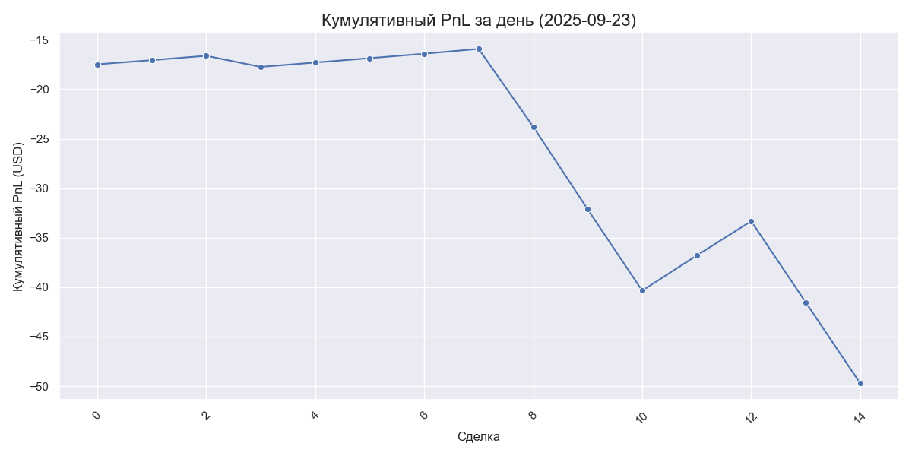

# 📈 Ежедневный отчет по торгам за 2025-09-23

## Основные метрики
- **Всего сделок**: 15
- **Прибыльные сделки**: 8
- **Убыточные сделки**: 7
- **Win Rate**: **53.33%**
- **Итоговый PnL**: **-49.71 USD**
- **Средняя прибыльная сделка**: +1.21 USD
- **Средняя убыточная сделка**: -8.49 USD

## График кумулятивного PnL за день

## Детализация сделок
|     timestamp | symbol   | side   |   qty |   entry_price |   exit_price |    pnl_usd | status   |   leverage |   cumulative_pnl |
|--------------:|:---------|:-------|------:|--------------:|-------------:|-----------:|:---------|-----------:|-----------------:|
| 1758620959045 | XRPUSDT  | Sell   |   786 |        2.8665 |       2.8474 | -17.4827   | LOSS     |         10 |         -17.4827 |
| 1758622274785 | XRPUSDT  | Sell   |    51 |        2.8514 |       2.8628 |   0.421117 | WIN      |         10 |         -17.0616 |
| 1758636558535 | XRPUSDT  | Sell   |    50 |        2.8606 |       2.8726 |   0.442337 | WIN      |         10 |         -16.6193 |
| 1758638144805 | XRPUSDT  | Sell   |    50 |        2.8727 |       2.8534 |  -1.12247  | LOSS     |         10 |         -17.7417 |
| 1758639330114 | XRPUSDT  | Sell   |    51 |        2.8548 |       2.8666 |   0.441315 | WIN      |         10 |         -17.3004 |
| 1758639330114 | XRPUSDT  | Sell   |    51 |        2.8548 |       2.8666 |   0.441315 | WIN      |         10 |         -16.8591 |
| 1758641064835 | XRPUSDT  | Sell   |    50 |        2.8659 |       2.878  |   0.447043 | WIN      |         10 |         -16.4121 |
| 1758646328625 | XRPUSDT  | Sell   |    50 |        2.878  |       2.8908 |   0.488725 | WIN      |         75 |         -15.9233 |
| 1758646948785 | XRPUSDT  | Sell   |   378 |        2.8923 |       2.8747 |  -7.85176  | LOSS     |         75 |         -23.7751 |
| 1758649304095 | XRPUSDT  | Sell   |   377 |        2.876  |       2.857  |  -8.35174  | LOSS     |         75 |         -32.1268 |
| 1758650636665 | XRPUSDT  | Sell   |   375 |        2.8607 |       2.8419 |  -8.22616  | LOSS     |         75 |         -40.353  |
| 1758651008945 | XRPUSDT  | Sell   |   375 |        2.8398 |       2.8524 |   3.55098  | WIN      |         75 |         -36.802  |
| 1758654392540 | XRPUSDT  | Sell   |   375 |        2.8516 |       2.864  |   3.47116  | WIN      |         75 |         -33.3309 |
| 1758658762345 | XRPUSDT  | Sell   |   375 |        2.8638 |       2.8451 |  -8.18996  | LOSS     |         75 |         -41.5208 |
| 1758658762345 | XRPUSDT  | Sell   |   375 |        2.8638 |       2.8451 |  -8.18996  | LOSS     |         75 |         -49.7108 |
