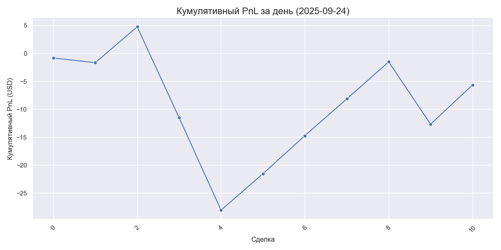

# 📈 Ежедневный отчет по торгам за 2025-09-24

## Основные метрики
- **Всего сделок**: 11
- **Прибыльные сделки**: 6
- **Убыточные сделки**: 5
- **Win Rate**: **54.55%**
- **Итоговый PnL**: **-5.65 USD**
- **Средняя прибыльная сделка**: +6.66 USD
- **Средняя убыточная сделка**: -9.12 USD

## График кумулятивного PnL за день

## Детализация сделок
|     timestamp | symbol   | side   |   qty |   entry_price |   exit_price |    pnl_usd | status   |   leverage |   cumulative_pnl |
|--------------:|:---------|:-------|------:|--------------:|-------------:|-----------:|:---------|-----------:|-----------------:|
| 1758665325657 | XRPUSDT  | Sell   |   374 |        2.844  |       2.8449 |  -0.833607 | LOSS     |         75 |        -0.833607 |
| 1758665325657 | XRPUSDT  | Sell   |   374 |        2.844  |       2.8449 |  -0.833607 | LOSS     |         75 |        -1.66721  |
| 1758673231805 | XRPUSDT  | Sell   |   760 |        2.8264 |       2.8382 |   6.41632  | WIN      |         75 |         4.7491   |
| 1758680304056 | XRPUSDT  | Sell   |   763 |        2.8383 |       2.8201 | -16.2611   | LOSS     |         75 |       -11.512    |
| 1758684558640 | XRPUSDT  | Sell   |   752 |        2.8234 |       2.8045 | -16.5405   | LOSS     |         75 |       -28.0525   |
| 1758698151585 | XRPUSDT  | Sell   |   728 |        2.858  |       2.8701 |   6.51527  | WIN      |         75 |       -21.5373   |
| 1758723110830 | XRPUSDT  | Sell   |   730 |        2.8744 |       2.8869 |   6.81184  | WIN      |         75 |       -14.7254   |
| 1758743428115 | XRPUSDT  | Sell   |   719 |        2.9584 |       2.9708 |   6.5709   | WIN      |         75 |        -8.15454  |
| 1758743791385 | XRPUSDT  | Sell   |   720 |        2.9798 |       2.9923 |   6.63505  | WIN      |         75 |        -1.51949  |
| 1758745979332 | XRPUSDT  | Sell   |   726 |        2.9702 |       2.9581 | -11.1518   | LOSS     |         75 |       -12.6713   |
| 1758747240845 | XRPUSDT  | Sell   |   721 |        2.9572 |       2.9702 |   7.02249  | WIN      |         75 |        -5.64877  |
